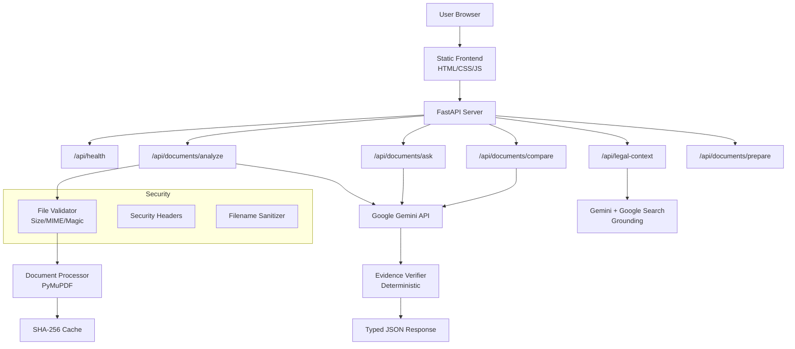

# LegalLens — Evidence-First Legal Document Navigator

> **"Understand what matters. Verify where it came from."**

## Challenge

**AI for Legal Assistance & Access** — Legal information is often complex and difficult to understand. LegalLens makes legal documents easier to understand, compare, navigate, and act on responsibly.

## Problem

When ordinary people encounter legal documents — employment agreements, rental contracts, service agreements — they face critical decisions without clear understanding. Generic AI chatbots can summarize PDFs, but they:

- **Fabricate clauses** that don't exist in the document
- **Omit critical information** without telling the user
- **Cannot distinguish** between what the document says vs. general knowledge
- **Provide no evidence trail** — users can't verify AI claims against the source
- **Skip missing information** — the most dangerous gaps go unnoticed

**Why can't you just upload a PDF to a normal AI assistant?** Because a normal AI won't tell you what's *missing* from your contract, won't link every claim to the exact page and clause, and won't refuse to answer when evidence doesn't exist.

## Solution

LegalLens implements a strict **NO EVIDENCE → NO CONFIDENT ANSWER** architecture:

Every factual statement about your document is backed by evidence with page numbers, section references, and source excerpts. When information is missing, LegalLens tells you what's absent and suggests questions to ask.

## Features

| Feature | Description |
|---------|-------------|
| **Personalized Analysis** | Select your concerns (salary, termination, non-compete, etc.) and get findings ranked by relevance |
| **Evidence-First Answers** | Every claim links to page number, section, and source excerpt |
| **Missing Information Detection** | First-class feature highlighting what's NOT in the document |
| **Document Q&A** | Ask questions — get grounded answers or explicit "not found" responses |
| **Document Comparison** | Structured "what changed" view between two document versions |
| **Professional Preparation** | Generate a printable meeting-prep sheet for lawyer/HR consultation |
| **External Legal Context** | Optional Google Search-grounded research, clearly separated from document analysis |
| **Multilingual Explanations** | English, Tamil, Hindi with original evidence preserved |
| **Accessibility** | Keyboard navigation, screen reader support, focus states, reduced motion |

## Evidence-First Architecture

```
┌─────────────────┐    ┌──────────────────┐    ┌─────────────────┐
│  Upload PDF     │───▶│  Extract Text    │───▶│  Build Prompt   │
│  (Validated)    │    │  (PyMuPDF)       │    │  (Evidence-First│
│                 │    │  Page-level      │    │   Constraints)  │
└─────────────────┘    └──────────────────┘    └────────┬────────┘
                                                        │
                                                        ▼
┌─────────────────┐    ┌──────────────────┐    ┌─────────────────┐
│  Return to UI   │◀──│  Verify Output   │◀──│  Gemini API     │
│  with Evidence  │    │  (Deterministic) │    │  (Structured    │
│  Badges         │    │  Anti-hallucin.  │    │   JSON Output)  │
└─────────────────┘    └──────────────────┘    └─────────────────┘
```

### No Evidence → No Confident Answer

Answers classify their support status:

| Status | Meaning |
|--------|---------|
| ✅ **SUPPORTED** | Evidence exists in the document |
| ⚠️ **PARTIALLY_SUPPORTED** | Some evidence found, but incomplete |
| ❌ **NOT_FOUND** | Information absent from the document |
| 🟣 **AMBIGUOUS** | Evidence exists but interpretation is unclear |

The **deterministic verifier** runs after every Gemini response:
- SUPPORTED claims without evidence are downgraded
- NOT_FOUND responses with fake evidence are cleared
- Invalid page numbers are removed
- Document name mismatches are flagged

## Google Services

| Google Service | Purpose | Integration Point |
|---|---|---|
| **Gemini API** (`google-genai` SDK) | Structured legal reasoning, evidence extraction, plain-language explanations | `app/services/gemini.py` |
| **Gemini Structured Output** | JSON schema enforcement for typed analysis results | All analysis/QA/comparison prompts |
| **Google Search Grounding** | Optional external legal context with web citations | `app/services/legal_context.py` |
| **Cloud Run** | Containerized production deployment | `Dockerfile` |
| **Secret Manager** | Production API key management | Deployment instructions |

## Architecture Diagram



## Safety & Hallucination Controls

1. **Evidence-first prompting**: System prompts require evidence for every factual claim
2. **Structured output**: Pydantic schemas validate all model responses
3. **Deterministic verifier**: Post-generation Python code validates evidence integrity
4. **Document-as-data**: Document text wrapped in `<DOCUMENT_DATA>` tags, system prompt explicitly states content is untrusted
5. **Abstention policy**: Model instructed to return NOT_FOUND rather than guess

## Prompt Injection Defenses

- All system prompts declare document content as **untrusted DATA**
- Instructions inside documents are explicitly prohibited from being followed
- System prompts are not exposed on request
- Model cannot call tools based on document instructions
- Tests verify injection text remains data

## Privacy & Security

- Uploaded documents processed via Google AI services
- No permanent document storage — files cleaned after processing
- In-memory SHA-256 cache for session reuse only
- Security headers on all responses (CSP, X-Content-Type-Options, etc.)
- No hardcoded secrets — environment variable configuration
- Generic error messages in production
- File validation: size limits, MIME checks, PDF magic bytes

## Accessibility

- Skip-to-content link
- Semantic HTML5 structure
- Keyboard navigable interface
- Visible focus states (2px solid outline)
- ARIA labels and roles
- `aria-live` regions for async updates
- Status conveyed by text + shape, not color alone
- Responsive mobile layout
- 44px minimum touch targets
- Reduced-motion media query support
- Screen-reader-friendly loading states

## Tech Stack

| Component | Technology |
|-----------|------------|
| Backend | Python 3.12, FastAPI, Pydantic v2 |
| AI | Google Gemini API (`google-genai` SDK) |
| PDF Processing | PyMuPDF (fitz) |
| Frontend | Vanilla HTML/CSS/JS (no build step) |
| Testing | pytest, httpx |
| Deployment | Docker, Cloud Run |
| CI | GitHub Actions |

## Local Setup

```bash
# 1. Clone the repository
git clone https://github.com/YOUR_USERNAME/legallens.git
cd legallens

# 2. Create virtual environment
python -m venv venv
source venv/bin/activate  # Windows: venv\Scripts\activate

# 3. Install dependencies
pip install -r requirements.txt

# 4. Configure environment
cp .env.example .env
# Edit .env and add your GEMINI_API_KEY

# 5. Run the application
uvicorn app.main:app --reload --port 8080

# 6. Open browser
# http://localhost:8080
```

## Environment Variables

| Variable | Required | Description |
|----------|----------|-------------|
| `GEMINI_API_KEY` | Yes (for AI features) | Google Gemini API key |
| `GEMINI_MODEL` | No | Model name (default: `gemini-2.5-flash`) |
| `APP_ENV` | No | `development` / `production` |
| `MAX_UPLOAD_MB` | No | Max upload size (default: 10) |
| `PORT` | No | Server port (default: 8080, set by Cloud Run) |

## Cloud Run Deployment

```bash
# 1. Set your project
export PROJECT_ID=your-gcp-project-id

# 2. Build and push Docker image
gcloud builds submit --tag gcr.io/$PROJECT_ID/legallens

# 3. Deploy to Cloud Run
gcloud run deploy legallens \
  --image gcr.io/$PROJECT_ID/legallens \
  --platform managed \
  --region us-central1 \
  --allow-unauthenticated \
  --set-secrets="GEMINI_API_KEY=gemini-api-key:latest" \
  --set-env-vars="APP_ENV=production,GEMINI_MODEL=gemini-2.5-flash" \
  --memory 512Mi \
  --cpu 1 \
  --timeout 120
```

For Secret Manager:
```bash
# Create secret
echo -n "your-api-key" | gcloud secrets create gemini-api-key --data-file=-

# Grant access to Cloud Run service account
gcloud secrets add-iam-policy-binding gemini-api-key \
  --member="serviceAccount:YOUR_SERVICE_ACCOUNT" \
  --role="roles/secretmanager.secretAccessor"
```

## Tests

```bash
# Run all tests (no Gemini API credits used)
pytest tests/ -v

# Run with coverage
pytest tests/ -v --tb=short
```

Tests verify:
- Health endpoint
- File upload validation (size, type, magic bytes)
- Filename sanitization
- Schema validation
- Evidence verifier logic
- Prompt injection defense
- API error handling
- App boot without Gemini key
- Security headers

## Repository Structure

```
legallens/
├── app/
│   ├── __init__.py
│   ├── main.py              # FastAPI application
│   ├── config.py             # Centralized configuration
│   ├── dependencies.py       # Dependency injection
│   ├── api/
│   │   ├── routes_health.py  # Health check
│   │   ├── routes_analysis.py # Document analysis + prepare
│   │   ├── routes_qa.py      # Document Q&A
│   │   ├── routes_compare.py # Document comparison
│   │   └── routes_research.py # External legal context
│   ├── core/
│   │   ├── security.py       # File validation, headers
│   │   ├── errors.py         # Error hierarchy
│   │   └── logging.py        # Structured logging
│   ├── models/
│   │   └── schemas.py        # Pydantic schemas
│   ├── services/
│   │   ├── gemini.py         # Gemini API integration
│   │   ├── document_processor.py  # PDF text extraction
│   │   ├── analyzer.py       # Analysis pipeline
│   │   ├── verifier.py       # Evidence verification
│   │   └── legal_context.py  # Search grounding
│   ├── prompts/
│   │   ├── analysis.py       # Analysis prompts
│   │   ├── qa.py             # Q&A prompts
│   │   ├── comparison.py     # Comparison prompts
│   │   └── research.py       # Research prompts
│   ├── templates/
│   │   └── index.html        # Frontend HTML
│   └── static/
│       ├── css/app.css        # Design system
│       └── js/app.js          # Frontend logic
├── tests/
│   └── test_app.py           # Comprehensive test suite
├── .github/workflows/ci.yml  # CI pipeline
├── Dockerfile                # Production Docker image
├── .dockerignore
├── .gitignore
├── .env.example
├── requirements.txt
├── README.md
├── ARCHITECTURE.md
├── SECURITY.md
├── PROMPTING.md
├── SUBMISSION.md
└── LICENSE
```

## Limitations

- PDF text extraction requires text-based PDFs (scanned image PDFs not supported without OCR)
- In-memory document cache is not persistent across server restarts
- Evidence page numbers depend on PDF structure quality
- External legal context requires internet access and Gemini Search grounding capability
- Single-server deployment (no distributed session sharing)

## Responsible Use

LegalLens provides document information and general assistance, **not professional legal advice**. For decisions with legal consequences, consider consulting a qualified legal professional.

---

Built for PromptWars: Virtual — Exclusive Edition Challenge | Google for Developers × H2S
